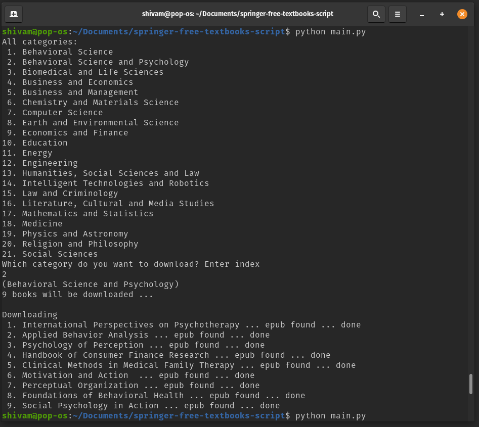

# springer-free-textbooks-script

Download [free textbooks from Singer](https://www.springernature.com/gp/librarians/news-events/all-news-articles/industry-news-initiatives/free-access-to-textbooks-for-institutions-affected-by-coronaviru/17855960), category wise

## Usage
```
$ git clone this repo
$ pip install requests beautifulsoup4
$ python3 main.py

$ pip install black
$ black -l 70 main.py 		# PEP8 formatting
```
